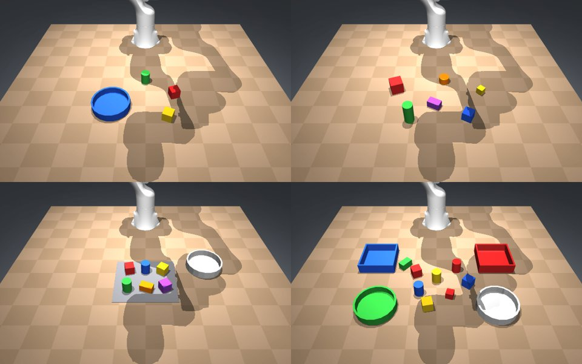

# ER-2 Viser Playground

**Watch Gemini Robotics ER 2 reason about a tabletop and drive a simulated Franka Panda, live in
your browser.**



Each turn, ER-2 sees a front and a side camera image and replies with one action (`pick`,
`place`, `home` or `done`) plus a target point in the image. The simulator turns that point into
a 3D target using the rendered depth and object mask. It then plans a smooth, fully checked path
(minimum-jerk Cartesian waypoints, [mink](https://github.com/kevinzakka/mink) differential IK) and
shows it to you. After you confirm, it executes the path in real time with physics-based grasps,
sends ER-2 fresh images, and repeats until ER-2 says it is done and checks its own result.

You can drag objects around (even mid-episode, so ER-2 has to adapt), add new ones, and record
and replay every run.

> Unofficial community project, not affiliated with or endorsed by Google DeepMind. It controls
> no physical robot and is not a sim-to-real recipe.

## Quick start

Requires Python 3.11+ and Linux, macOS or Windows. A GPU is not needed but makes rendering faster.

```bash
git clone <this repo> er2-viser-demo && cd er2-viser-demo
python -m venv .venv && source .venv/bin/activate      # or: conda create -n er2 python=3.11
pip install -e .
er2-demo                                               # opens on http://localhost:8080
```

The first launch downloads the Franka Panda model (~33 MB) from
[MuJoCo Menagerie](https://github.com/google-deepmind/mujoco_menagerie) at a pinned commit, checks
every file's SHA-256 hash, and caches it.

**Without an API key** you can still explore everything: edit scenes and replay the two example
episodes in `examples/recordings/`. These are real ER-2 outputs, re-simulated.

**For live ER-2 runs**, you need a Gemini API key with access to the Gemini Robotics-ER preview
model:

```bash
export GEMINI_API_KEY=...      # never paste it into the UI or commit it
er2-demo --preset sort
```

Options: `--preset {pick_place,sort,spatial,clutter,multi_sort}`, `--port 8080`, and
`--host 0.0.0.0` to open it from another machine on your network.

## Presets

| Preset | What it shows | Typical steps |
|---|---|---|
| `pick_place` | Put the red cube in the blue bowl, with distractors | 3 |
| `sort` | Sort by colour into two bins | 9 |
| `spatial` | Build a tower from 3 cubes of different sizes, largest at the bottom | 5 |
| `clutter` | Clear a grey mat of 6 tightly packed objects | 13 |
| `multi_sort` | 4 containers; sort by shape **and** colour, and leave distractors alone | 13 |

The task text is only a default; type any instruction, e.g. *"put the smallest object to the
left of the tallest one"*. Layouts you save with **Save as preset** go to `./presets/` (set
`ER2_PRESETS_DIR` to change this).

## Using the UI

**Agent tab**
1. Choose a **Scene preset** and edit the **Task** if you like.
2. Press **Run**. Each turn, ER-2's point and label are drawn on the *Cameras* tab. The 3D view
   shows the target (magenta) and the planned gripper path (blue), and the log shows ER-2's
   reasoning.
3. Press **Execute proposed action** or **Skip / ask again**. Tick **Auto-run** to skip
   confirmations.
4. At the end, ER-2 assesses the final image itself and the verdict appears in the banner.
5. **Stop** halts the arm. **Reset scene** restores the preset.

**Scene tab**: select an object and drag or rotate it with the gizmo. You can also add cubes,
cuboids, cylinders, spheres, bowls, bins and flat "mat" zones (S/M/L, in any colour), delete
objects, and save the layout.

**Robot & scene** folder: grasp mode, arm speed, step limit, and an *Arm to home* button.
- *physics+assist* (default): a real friction grasp. If the object slips as it is lifted, a weld
  "grasp assist" engages and the log says so.
- *physics*: slips stay failures.
- *always weld*: the object attaches whenever the fingers close on it.

## Record & replay

Every live run is saved to `./recordings/<time>_<scene>/`: the scene, the task, every raw ER-2
reply, a front image per step and the self-assessment (set `ER2_RECORDINGS_DIR` to change the
location). In **Mode → Replay recording**, pick a run and press **Run**. The scene is restored
and the recorded replies are fed back turn by turn while the motion is re-simulated. A
**REPLAY** banner makes clear that it isn't live. This makes a good fallback for live talks.

## How it works

```
 cameras ──► ER-2 (JSON: action + [y,x] point) ──► point → 3D (depth + segmentation)
    ▲                                                        │
    │                                           pick / place / stack / container logic
    │                                                        ▼
 Viser ◄── sim thread (MuJoCo 500 Hz, the only owner) ◄── min-jerk Cartesian path → mink IK
```

| Module | Role |
|---|---|
| `scene.py` | JSON scene spec (primitive shapes, containers, mats); builds the MJCF with `MjSpec` around the Menagerie Panda (gravity-compensated) |
| `sim.py` | The only thread that touches MuJoCo: physics, 100 Hz trajectory playback, grasp assist, camera capture, streaming to Viser |
| `planner.py` | Minimum-jerk Cartesian segments → mink IK on a separate robot-only model; every trajectory is solved and checked before it runs |
| `skills.py` | Image point → 3D target; snaps picks to the object; stacking, free spots in containers, grasp angles that keep the fingers clear in clutter |
| `er2.py` | Gemini client (Interactions API, falling back to `generate_content`), prompts, tolerant JSON parsing |
| `agent.py` | The closed-loop episode, confirmation gate, recorder, replay |
| `ui.py` | Viser GUI, image overlays, 3D markers, scene editor |

The design notes are in [docs/design.md](docs/design.md).

## Configuration

| Variable | Default | Purpose |
|---|---|---|
| `GEMINI_API_KEY` | — | Required for live runs |
| `ER2_MODEL_ID` | `gemini-robotics-er-2-preview` | Model to call |
| `ER2_TRANSPORT` | `auto` | `interactions`, `generate` (`generate_content`), or `auto` (try `interactions`, then fall back) |
| `ER2_RECORDINGS_DIR` | `./recordings` | Where live runs are saved |
| `ER2_PRESETS_DIR` | `./presets` | Where saved layouts go |
| `ER2_PANDA_DIR` | cache | Use an existing `franka_emika_panda/` folder |
| `MUJOCO_GL` | `egl` on Linux | Offscreen rendering backend (`egl`, `osmesa`, `glfw`) |

## Troubleshooting

- **Rendering or EGL errors on Linux:** install `libegl1` (plus `libegl-mesa0` if you have no NVIDIA
  driver), or try `MUJOCO_GL=osmesa` (needs `libosmesa6`).
- **"GEMINI_API_KEY is not set" or "rejected the API key or model access":** check the key and
  that your account can use the ER preview model. Replay still works without it.
- **ER-2 requests fail on one API:** try `ER2_TRANSPORT=generate er2-demo` (or `interactions`).
- **"out of reach" or "joint flip" in the log:** ER-2 pointed somewhere the arm can't get to. The
  message is sent back to ER-2 so it can choose again.

## Development

```bash
pip install -e ".[dev]"
ruff check src tests
pytest -q          # no API calls; about 6 minutes on a laptop CPU
```

The end-to-end tests use a **test-only oracle** client that writes ER-2-format JSON from ground
truth, so they can exercise the whole pipeline. It is never used by the app; don't present its
output as ER-2. `tests/test_examples.py` replays the shipped real ER-2 episodes.

## Acknowledgements and related work

Built on [MuJoCo](https://mujoco.org) (Todorov et al., IROS 2012),
[MuJoCo Menagerie](https://github.com/google-deepmind/mujoco_menagerie),
[Viser](https://github.com/nerfstudio-project/viser) (Yi et al., 2025),
[mjviser](https://pypi.org/project/mjviser/) and [mink](https://github.com/kevinzakka/mink), and
driven by Gemini Robotics-ER (Gemini Robotics Team, *"Gemini Robotics: Bringing AI into the
Physical World"*, 2025). The pointing-then-planning approach follows work such as MOKA (Liu et
al., RSS 2024) and RoboPoint (Yuan et al., CoRL 2024). Feeding each result back to the model
follows Inner Monologue (Huang et al., CoRL 2022).

## License

Code: MIT (see [LICENSE](LICENSE)). The Franka Panda model is downloaded from MuJoCo Menagerie
under Apache-2.0 and is not redistributed here (see
[THIRD_PARTY_NOTICES.md](THIRD_PARTY_NOTICES.md)). The example recordings contain outputs of a
Google preview model; check the Gemini API terms before reusing them. If this is useful in your
work, see [CITATION.cff](CITATION.cff).
